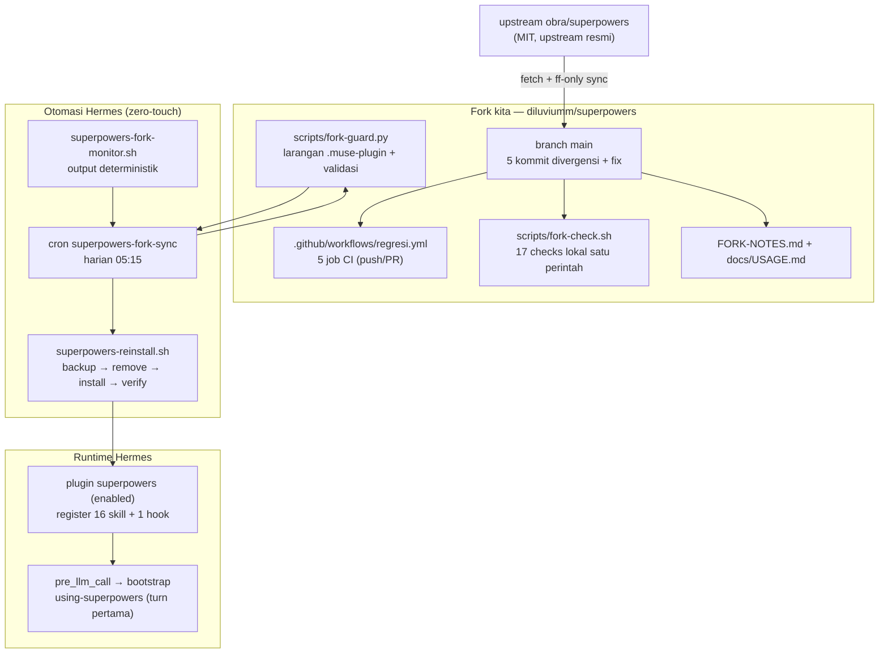
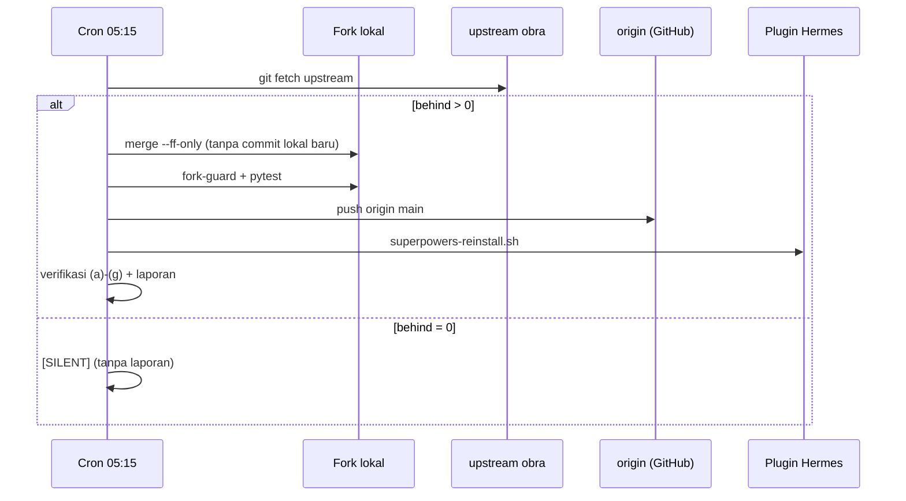
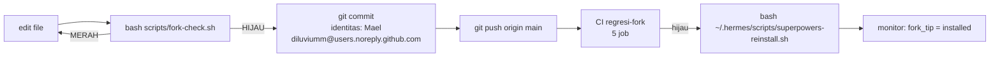

# Panduan Penggunaan — Fork `diluviumm/superpowers`

Panduan lengkap cara memakai, memverifikasi, memperbarui, dan memelihara fork ini.
Divergensi teknis vs upstream ada di [FORK-NOTES.md](../FORK-NOTES.md); dokumen ini
fokus pada **tata cara penggunaan sehari-hari**.

---

## 1. Arsitektur



**Alur singkat:** upstream → sync harian (cron) → guard+test → push → CI hijau →
reinstall plugin → sesi Hermes baru dapat bootstrap `using-superpowers`.

---

## 2. Pemasangan & Pembaruan

### Pasang (sekali)

```bash
hermes plugins install diluviumm/superpowers --enable --force
```

### Perbarui ke tip fork terbaru

```bash
bash ~/.hermes/scripts/superpowers-reinstall.sh
```

Script ini: **backup metadata → remove → install → verifikasi** (aman dari jebakan
pin `--ref`; lihat §7).

### Rollback ke revisi tertentu

```bash
bash ~/.hermes/scripts/superpowers-reinstall.sh <tag-atau-sha-40-char>
```

> ⚠️ `--ref` men-set **pin permanen**. Untuk melepas pin: script reinstall di atas
> (jalur hapus + pasang ulang) — tidak ada perintah `unpin`.

---

## 3. Verifikasi Kesehatan (kapan pun)

```bash
bash ~/.hermes/scripts/superpowers-fork-monitor.sh
hermes plugins doctor superpowers
python3 scripts/fork-guard.py
bash scripts/fork-check.sh          # baterai penuh, 17 checks
```

### Membaca output monitor

| Field | Nilai sehat | Arti bila tidak sehat |
|---|---|---|
| `behind` | `0` | `>0` → ada commit upstream belum masuk (cron 05:15 akan sync) |
| `fork_tip` | sha = `origin/main` | berbeda → ada commit lokal belum push |
| `installed` | = `fork_tip` | beda → instalasi plugin basi → jalankan reinstall |
| `muse_repo` | `hilang` | `ada` → fix discovery Hermes hilang → **jangan push**, pulihkan |
| `muse_installed` | `hilang` | `ada` → instalasi kotor → reinstall |

---

## 4. Otomatisasi (berjalan tanpa sentuhan)

| Komponen | jadwal/trigger | peran |
|---|---|---|
| cron `superpowers-fork-sync` | harian 05:15 | fetch → ff-only merge → guard+pytest → push → reinstall bila basi → verifikasi (a)–(h) termasuk baterai `fork-check.sh` harian |
| monitor `superpowers-fork-monitor.sh` | dipanggil cron | output deterministik; agent hanya terbangun saat status BERUBAH |
| CI `regresi-fork` | setiap push/PR ke `main` | 5 job: fork-guard, hermes-tests, bash-suite, node-suite, harness-suites |
| hook `pre_llm_call` | turn pertama tiap sesi | inject bootstrap `using-superpowers` |

### Sequence: sync harian



---

## 5. Menjalankan Test Lokal

```bash
bash scripts/fork-check.sh
```

| Grup | Checks | Setara CI? |
|---|---|---|
| Struktur & guard | fork-guard, shell lint (semua `.sh`) | ✅ job `fork-guard` + `bash-suite` |
| Suite Hermes | pytest `tests/hermes/` (19 test) | ✅ job `hermes-tests` |
| Suite bash | shell-lint, diagnosing (46), hooks, systematic-debugging | ✅ job `bash-suite` |
| Suite node | brainstorm-server (branding, lifecycle, ws, start/stop) | ✅ job `node-suite` |
| Suite harness | opencode ×2, kimi, devin, antigravity, codex ×3, pi | ✅ job `harness-suites` |

Suite yang sengaja **tidak** dijalankan (butuh tool/layanan tambahan):
`writing-skills` (graphviz), `version-bump` (yq), `explicit-skill-requests`
(API model), serta suite harness berat spesifik.

---

## 6. Alur Kerja Perubahan Lokal



Aturan wajib:

1. **Jangan revert** 5 kommit divergensi inti (`.muse-plugin` absent, `FORK-NOTES.md`,
   `regresi.yml`, `fork-guard.py`, banner README) — dijaga guard + CI.
2. Setiap perubahan divergensi **wajib tercatat** di tabel FORK-NOTES.
3. Jangan push dengan working tree kotor berisi perubahan yang bukan milik sync.

---

## 7. Troubleshooting

| Gejala | Akar masalah | Solusi |
|---|---|---|
| Update terasa "macet" setelah rollback | pin `--ref` permanen di `.install-metadata.json` | `bash ~/.hermes/scripts/superpowers-reinstall.sh` (hapus + pasang ulang) |
| Perintah `git`/`hermes` error symbol lookup | LD leak AppImage Termic | bungkus `env -u LD_LIBRARY_PATH -u LD_PRELOAD …` |
| Warning `plugin.json declares an unsupported…` | `.muse-plugin/plugin.json` balik terdeteksi | **jangan dipulihkan**; jalankan `fork-guard` → hapus file itu |
| Test branding gagal "logo by default" | var telemetry ambien bocor ke test | sudah difix (strip otomatis); jalankan ulang `npm test` |
| `zip not found` saat packaging Codex | host tanpa binari `zip` | sudah difix: fallback `python3 zipfile` deterministik |
| Bootstrap `using-superpowers` hilang di sesi baru | sesi terkena kompaksi setelah turn pertama | buat sesi baru (keterbatasan Hermes, belum ada hook post-compaction) |
| Hook tidak fire di `hermes serve` / dashboard | plugin discovery dilewati di jalur serve (issue Hermes #102592, terverifikasi ada di kode v0.21.5) | pakai `hermes chat` / TUI; perbaikan milik hulu Hermes |

---

## 8. Batasan yang Diketahui

1. **Post-compaction hook tidak ada** → sesi yang terkompaksi setelah turn pertama
   kehilangan bootstrap. Solusi: sesi baru.
2. **`hermes serve` / `dashboard` tidak menjalankan plugin discovery** → hook
   `pre_llm_call` tidak fire untuk giliran web/desktop-backend (NousResearch
   hermes-agent#102592; terverifikasi lokal: `_AGENT_COMMANDS` tanpa `serve`, dan
   `start_server()` tanpa `discover_plugins()`). TUI/`hermes chat` normal.
3. **Fork konsumen** → tidak ada PR fork-specific ke upstream (kebijakan
   `AGENTS.md` upstream). Perbaikan hulu diarahkan ke repo Hermes.

---

## 9. Referensi Cepat

| Perintah | Fungsi |
|---|---|
| `bash scripts/fork-check.sh` | verifikasi lokal penuh (17 checks) |
| `bash ~/.hermes/scripts/superpowers-fork-monitor.sh` | status sinkron 5 field |
| `bash ~/.hermes/scripts/superpowers-reinstall.sh` | reinstall/rollback resmi |
| `hermes plugins doctor superpowers` | kesehatan plugin di Hermes |
| `git diff upstream/main..main` | daftar divergensi (harus = tabel FORK-NOTES) |
| `python3 scripts/fork-guard.py` | guard divergensi wajib |
